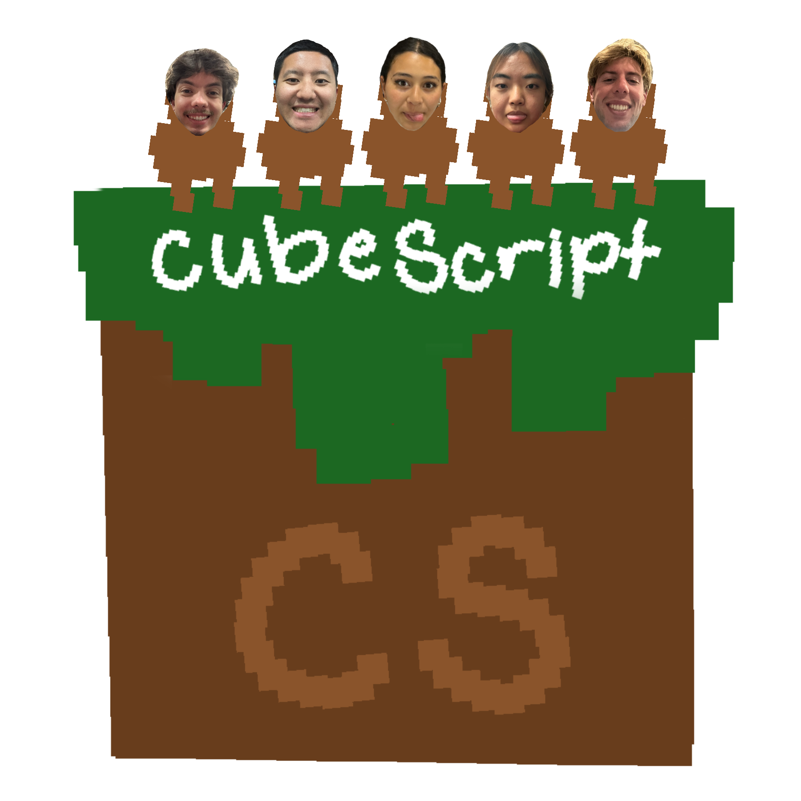

# Cubescript

<div align="center">



**Write logic for cube worlds — statically checked, Sponge-ready.**

[]()
[]()

</div>

## Team

| Name           | GitHub                                             |
| -------------- | -------------------------------------------------- |
| Mason Lui      | [@MasonLui](https://github.com/MasonLui)           |
| Leila Nawas    | [@leilanawas](https://github.com/leilanawas)       |
| Aidan Hodges   | [@aidanhodges27](https://github.com/aidanhodges27) |
| Paige Inoue    | [@paigei](https://github.com/paigei)               |
| Cooper Clausen | [@CooperClausen](https://github.com/CooperClausen) |

## One-paragraph story

**Cubescript** is a statically checked scripting language designed for the **Sponge** modding ecosystem. You write `.cube` files that describe game logic — event handlers, world queries, item recipes — and the compiler catches scope errors, bad control flow, and undefined names at compile time instead of deep inside a running Minecraft server. Cubescript compiles to JavaScript intended to run inside a [SpongeForge](https://spongepowered.org/) plugin host via **GraalVM's Polyglot API**, which lets the JVM execute JS without leaving the server process or launching any external runtime. Under the hood this is a real CMSI 3802 pipeline: Ohm grammar → AST → static analysis → constant-folding optimizer → JS codegen.

_Cubescript is a student project and is not affiliated with Mojang, Microsoft, Minecraft, or the SpongePowered project._

## Target runtime architecture

```
.cube source
    │
    ▼  cubescript compile
 JavaScript (ES module)
    │
    ▼  embedded inside
 SpongeForge plugin (Java)
    │  ← loads via GraalVM Polyglot API
    ▼
 Minecraft: Java Edition server
```

A thin companion Sponge plugin loads the compiled `.cube` output using GraalVM's `Context.eval("js", ...)` — no external Node process, no separate runtime. The companion plugin host is **not yet implemented** and is future work.

## Features

- File extension **`.cube`** (Cubescript source)
- **`let`** variable declarations and **assignment** (`x = expr;`)
- **Number**, **boolean** (`true`/`false`), and **string** literals
- Arithmetic `+`, `-`, `*`, `/` with correct precedence and parentheses
- Comparison operators `==`, `!=`, `<`, `>`, `<=`, `>=`
- Logical operators `&&`, `||`, and unary `!` and `-`
- **Function declarations** (`mine`) with parameters and return values
- **`if` / `else`** conditional statements
- **`while`** loops with **`break`**
- Static scope: undefined identifiers and duplicate bindings caught at compile time
- `return` outside a function → compile-time error
- `break` outside a loop → compile-time error
- **Constant folding** for all numeric arithmetic, comparisons, and boolean operations
- JavaScript code generation (GraalVM-compatible ES output)

## Static, safety, and security checks

| Check                                                        | Status      |
| ------------------------------------------------------------ | ----------- |
| Parse / syntax errors                                        | Implemented |
| Undefined identifiers                                        | Implemented |
| Duplicate bindings in the same scope                         | Implemented |
| Undefined function names                                     | Implemented |
| `return` outside a function                                  | Implemented |
| `break` / `continue` outside a loop                          | Implemented |
| Constant folding (arithmetic, comparisons, booleans)         | Implemented |
| Type checking (arithmetic, comparisons, logical, assignment) | Implemented |

**Security note:** the CLI `run` command uses `eval` only as a teaching shortcut. The production path is `generate` → embed output in the Sponge GraalVM host.

## Setup

1. **Install Node 18+** (LTS is fine).
2. In this directory run **`npm install`**.
3. Run **`npm test`** — all tests should pass and coverage will be reported.
4. Try the CLI:
   ```bash
   node src/cubescript.js run examples/12-mod-recipe.cube
   ```
5. Public repo: **https://github.com/MasonLui/CubeScript**
6. Companion site: **https://masonlui.github.io/CubeScript/**

## Repository layout

```
src/
  cubescript.js    CLI entry point
  cubescript.ohm   Ohm grammar
  parser.js        Ohm → AST
  analyzer.js      Static analysis
  optimizer.js     Constant folding
  generator.js     AST → JavaScript
  compiler.js      Pipeline glue
  core.js          CubescriptError

test/
  parser.test.js
  analyzer.test.js
  optimizer.test.js
  generator.test.js
  compiler.test.js

examples/
  01-hello.cube    02-arithmetic.cube  03-variables.cube
  04-strings.cube  05-scope-error.cube 06-hello-world.cube
  07-functions.cube 08-conditionals.cube 09-while-loop.cube
  10-booleans.cube  11-comparisons.cube  12-mod-recipe.cube

docs/             Companion website (GitHub Pages)
```

## Usage (CLI)

```bash
npm install
node src/cubescript.js syntax   examples/12-mod-recipe.cube
node src/cubescript.js parse    examples/12-mod-recipe.cube
node src/cubescript.js analyze  examples/12-mod-recipe.cube
node src/cubescript.js optimize examples/12-mod-recipe.cube
node src/cubescript.js generate examples/12-mod-recipe.cube
node src/cubescript.js run      examples/12-mod-recipe.cube
```

Global install (optional): `npm link` then `cubescript run file.cube`.

## Examples vs JavaScript

| Cubescript                               | Generated JavaScript                         |
| ---------------------------------------- | -------------------------------------------- |
| `let x = 2 + 3;`                         | `let x = 5;` (constant-folded)               |
| `let ok = 4 >= 4;`                       | `let ok = true;` (constant-folded)           |
| `mine double(n) { return n * 2; }`       | `function double(n) { return (n * 2); }`     |
| `if (x > 0) { x = 1; } else { x = -1; }` | `if ((x > 0)) { x = 1; } else { x = (-1); }` |
| `while (i > 0) { i = i - 1; }`           | `while ((i > 0)) { i = (i - 1); }`           |

## Grammar

Ohm spec: [`src/cubescript.ohm`](src/cubescript.ohm)

## Tests and coverage

```bash
npm test
```

Uses `c8` over Node's built-in test runner. Current baseline: **118 tests, all passing**.

## License

MIT — see `LICENSE`
